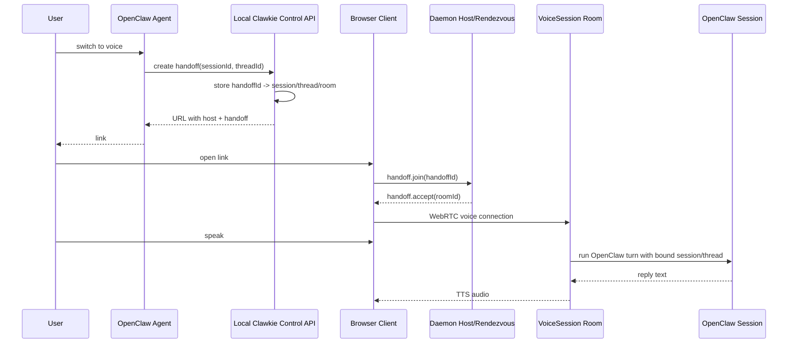

# Rendezvous Voice Handoff Implementation Plan

> **For Claude:** REQUIRED SUB-SKILL: Use superpowers:executing-plans to implement this plan task-by-task.

**Goal:** Make Clawkie-Talkie production-credible for OpenClaw voice handoff by replacing the current single-phone daemon lane with a durable local rendezvous daemon that can create independent per-session voice rooms for multiple OpenClaw/Discord conversations.

**Architecture:** Keep one long-running local Clawkie daemon on the OpenClaw machine. Treat the daemon host ID as the stable control/rendezvous identity, but move actual voice turns into per-handoff `VoiceSession` rooms bound daemon-side to one OpenClaw session/thread. Add a small local handoff API/CLI so agents request “create voice handoff for this current conversation” and receive a valid link, instead of manually assembling `host`, `session`, and `threadId` URL params.

**Tech Stack:** TypeScript, React/Vite client, Node/tsx daemon, simple-peer + `@roamhq/wrtc`, rambly-style signaling, Vitest, OpenClaw CLI integration.

---

## Context From Thread

The intended user flow:

1. User is in an OpenClaw/Discord session/thread.
2. User says “switch to voice.”
3. Agent posts a Clawkie-Talkie link.
4. User opens the link.
5. User speaks on the Clawkie page.
6. Clawkie transcribes speech, runs the OpenClaw session, mirrors the transcript/reply back into the originating Discord/OpenClaw thread, and speaks the reply back on the page.

The key repo-backed blocker:

- Current daemon is single-session / one phone at a time.
  - `daemon/README.md` says “Single-session daemon” and “accepts one phone WebRTC DataChannel at a time.”
  - `daemon/src/peer.ts` stores singleton `peer`, `remoteId`, `activeSessionId`, `activeThreadId`, `stt`, `tts`, `chatAbort`, and `turnInFlight` fields.
  - `daemon/src/peer.ts` rejects a second connected phone with `rejecting second phone ... one at a time`.
- Current browser URL carries routing authority.
  - `client/src/app.tsx` parses `host`, `session`, and `threadId` from query params.
  - `client/src/voice/sttDaemon.ts` sends `stt.start(sessionId, threadId)`.
  - `daemon/src/peer.ts` accepts those values and assigns `activeSessionId` / `activeThreadId`.
- Current `host` is the actual signaling room.
  - `client/src/rtc/client.ts` creates `SignalClient({ roomName: opts.hostPeerId })`.
  - `daemon/src/peer.ts` creates `SignalClient({ roomName: opts.peerId })`.

User-facing production problem:

- Thread A asks “switch to voice” and gets link A.
- Thread B asks “switch to voice” and gets link B.
- Both links target the same daemon host.
- User expects Discord-like independent voice sessions.
- Today, both are trying to use the same singleton phone/WebRTC lane.

Target shape:

- One durable local Clawkie daemon.
- `host=H` is coordination/rendezvous identity, not the single voice lane.
- Each handoff gets an opaque `handoffId` and per-session `roomId`.
- Daemon owns `handoffId -> { sessionId, threadId, roomId }`.
- Browser does not choose routing by sending arbitrary `sessionId/threadId` later.
- Multiple voice rooms can coexist: A, B, C.

## Non-Goals

- Do not implement “one daemon per handoff.”
- Do not build a separate hosted/cloud gateway.
- Do not merge Clawkie into OpenClaw core.
- Do not require agents to start/kill/manage Node daemons per handoff.
- Do not run `npm run dev`, `npm run daemon`, or other long-running Node servers during implementation unless David explicitly asks. Use tests/typecheck/build for verification.

---

## Task 1: Add a daemon-owned handoff registry

**Files:**
- Create: `daemon/src/handoffRegistry.ts`
- Create: `test/handoffRegistry.test.ts`

**Step 1: Write failing tests for creating handoffs**

Create `test/handoffRegistry.test.ts`:

```ts
import { describe, expect, it, vi } from 'vitest';
import { createHandoffRegistry } from '../daemon/src/handoffRegistry';

describe('handoff registry', () => {
  it('creates an opaque handoff bound to a session/thread and room', () => {
    const registry = createHandoffRegistry({
      hostPeerId: 'host-1',
      now: () => 1000,
      id: () => 'handoff-1',
      ttlMs: 60_000,
    });

    const handoff = registry.create({
      sessionId: 'agent:main:discord:channel-1:thread-1',
      threadId: 'thread-1',
    });

    expect(handoff).toEqual({
      handoffId: 'handoff-1',
      roomId: 'host-1:handoff-1',
      expiresAt: 61_000,
    });

    expect(registry.get('handoff-1')).toMatchObject({
      handoffId: 'handoff-1',
      roomId: 'host-1:handoff-1',
      sessionId: 'agent:main:discord:channel-1:thread-1',
      threadId: 'thread-1',
    });
  });

  it('rejects expired handoffs and removes them', () => {
    let now = 1000;
    const registry = createHandoffRegistry({
      hostPeerId: 'host-1',
      now: () => now,
      id: () => 'handoff-1',
      ttlMs: 10,
    });

    registry.create({ sessionId: 's1', threadId: 't1' });
    now = 1011;

    expect(registry.get('handoff-1')).toBeUndefined();
    expect(registry.has('handoff-1')).toBe(false);
  });

  it('can revoke a handoff', () => {
    const registry = createHandoffRegistry({
      hostPeerId: 'host-1',
      now: () => 1000,
      id: () => 'handoff-1',
      ttlMs: 60_000,
    });

    registry.create({ sessionId: 's1', threadId: 't1' });
    registry.revoke('handoff-1');

    expect(registry.get('handoff-1')).toBeUndefined();
  });
});
```

**Step 2: Run test to verify it fails**

Run:

```bash
cd /mnt/data/play/web/clawkie-talkie
npm test -- test/handoffRegistry.test.ts
```

Expected: FAIL because `daemon/src/handoffRegistry.ts` does not exist.

**Step 3: Implement the registry**

Create `daemon/src/handoffRegistry.ts`:

```ts
export interface HandoffRecord {
  handoffId: string;
  roomId: string;
  sessionId: string;
  threadId?: string;
  createdAt: number;
  expiresAt: number;
}

export interface HandoffRegistryOptions {
  hostPeerId: string;
  ttlMs?: number;
  now?: () => number;
  id?: () => string;
}

export interface CreateHandoffInput {
  sessionId: string;
  threadId?: string;
}

export interface CreatedHandoff {
  handoffId: string;
  roomId: string;
  expiresAt: number;
}

const DEFAULT_TTL_MS = 10 * 60 * 1000;

export function createHandoffRegistry(opts: HandoffRegistryOptions) {
  const now = opts.now ?? Date.now;
  const makeId = opts.id ?? randomId;
  const ttlMs = opts.ttlMs ?? DEFAULT_TTL_MS;
  const records = new Map<string, HandoffRecord>();

  function purgeExpired(): void {
    const t = now();
    for (const [id, rec] of records) {
      if (rec.expiresAt <= t) records.delete(id);
    }
  }

  return {
    create(input: CreateHandoffInput): CreatedHandoff {
      purgeExpired();
      const handoffId = makeId();
      const createdAt = now();
      const expiresAt = createdAt + ttlMs;
      const roomId = `${opts.hostPeerId}:${handoffId}`;
      records.set(handoffId, {
        handoffId,
        roomId,
        sessionId: input.sessionId,
        threadId: input.threadId,
        createdAt,
        expiresAt,
      });
      return { handoffId, roomId, expiresAt };
    },

    get(handoffId: string): HandoffRecord | undefined {
      purgeExpired();
      return records.get(handoffId);
    },

    has(handoffId: string): boolean {
      purgeExpired();
      return records.has(handoffId);
    },

    revoke(handoffId: string): void {
      records.delete(handoffId);
    },

    list(): HandoffRecord[] {
      purgeExpired();
      return [...records.values()];
    },
  };
}

function randomId(): string {
  return crypto.randomUUID();
}
```

**Step 4: Run test to verify it passes**

Run:

```bash
npm test -- test/handoffRegistry.test.ts
```

Expected: PASS.

**Step 5: Commit**

```bash
git add daemon/src/handoffRegistry.ts test/handoffRegistry.test.ts
git commit -m "feat: add voice handoff registry"
```

---

## Task 2: Change the wire protocol so routing is daemon-owned

**Files:**
- Modify: `daemon/src/protocol.ts`
- Modify: `client/src/voice/protocol.ts`
- Modify: `test/protocol.test.ts`

**Step 1: Write failing protocol tests**

Update `test/protocol.test.ts` to include handoff messages:

```ts
expect(phoneClient.handoffJoin('handoff-1')).toEqual({
  t: 'handoff.join',
  handoffId: 'handoff-1',
});
expect(daemonClient.handoffAccept('room-1')).toEqual({
  t: 'handoff.accept',
  roomId: 'room-1',
});
expect(daemonClient.handoffError('expired')).toEqual({
  t: 'handoff.error',
  message: 'expired',
});
expect(phoneClient.sttStart()).toEqual({ t: 'stt.start' });
```

Also remove/update expectations that `stt.start` serializes `sessionId` and `threadId`.

**Step 2: Run test to verify it fails**

```bash
npm test -- test/protocol.test.ts
```

Expected: FAIL because factories do not exist and `stt.start` still accepts route IDs.

**Step 3: Update daemon protocol**

In `daemon/src/protocol.ts`:

```ts
export type PhoneToDaemon =
  | { t: 'handoff.join'; handoffId: string }
  | { t: 'stt.start' }
  | { t: 'stt.audio.done' }
  | { t: 'stt.cancel' }
  | { t: 'reply.cancel' };

export type DaemonToPhone =
  | { t: 'handoff.accept'; roomId: string }
  | { t: 'handoff.error'; message: string }
  | { t: 'stt.ready' }
  // keep existing messages...
```

Update factories:

```ts
export const phoneToDaemon = {
  handoffJoin: (handoffId: string): PhoneToDaemon => ({ t: 'handoff.join', handoffId }),
  sttStart: (): PhoneToDaemon => ({ t: 'stt.start' }),
  // keep existing factories...
};

export const daemonToPhone = {
  handoffAccept: (roomId: string): DaemonToPhone => ({ t: 'handoff.accept', roomId }),
  handoffError: (message: string): DaemonToPhone => ({ t: 'handoff.error', message }),
  // keep existing factories...
};
```

Mirror the same changes in `client/src/voice/protocol.ts`.

**Step 4: Run protocol tests**

```bash
npm test -- test/protocol.test.ts
```

Expected: PASS.

**Step 5: Commit**

```bash
git add daemon/src/protocol.ts client/src/voice/protocol.ts test/protocol.test.ts
git commit -m "feat: add voice handoff protocol messages"
```

---

## Task 3: Add a local handoff creation API to the daemon

**Files:**
- Create: `daemon/src/controlServer.ts`
- Modify: `daemon/src/index.ts`
- Create: `test/controlServer.test.ts`

**Step 1: Write failing tests for the control API handler**

Do not test an actual long-running server. Test pure request handling with injected registry.

Create `test/controlServer.test.ts`:

```ts
import { describe, expect, it } from 'vitest';
import { handleCreateHandoffRequest } from '../daemon/src/controlServer';
import { createHandoffRegistry } from '../daemon/src/handoffRegistry';

describe('control server handoff creation', () => {
  it('returns a client URL with host and handoff token', async () => {
    const registry = createHandoffRegistry({
      hostPeerId: 'host-1',
      now: () => 1000,
      id: () => 'handoff-1',
      ttlMs: 60_000,
    });

    const res = await handleCreateHandoffRequest({
      body: JSON.stringify({ sessionId: 'session-1', threadId: 'thread-1' }),
      clientOrigin: 'https://clawkie-talkie.davidguttman.jump.sh',
      hostPeerId: 'host-1',
      registry,
    });

    expect(res.status).toBe(200);
    expect(JSON.parse(res.body)).toEqual({
      handoffId: 'handoff-1',
      roomId: 'host-1:handoff-1',
      expiresAt: 61_000,
      url: 'https://clawkie-talkie.davidguttman.jump.sh/?screen=handoff&host=host-1&handoff=handoff-1',
    });
  });

  it('rejects missing sessionId', async () => {
    const registry = createHandoffRegistry({ hostPeerId: 'host-1' });
    const res = await handleCreateHandoffRequest({
      body: JSON.stringify({ threadId: 'thread-1' }),
      clientOrigin: 'https://example.test',
      hostPeerId: 'host-1',
      registry,
    });
    expect(res.status).toBe(400);
  });
});
```

**Step 2: Run test to verify it fails**

```bash
npm test -- test/controlServer.test.ts
```

Expected: FAIL because `daemon/src/controlServer.ts` does not exist.

**Step 3: Implement pure handler and server bootstrap**

Create `daemon/src/controlServer.ts`:

```ts
import http from 'node:http';
import type { createHandoffRegistry } from './handoffRegistry.js';

type Registry = ReturnType<typeof createHandoffRegistry>;

export interface HandleCreateHandoffRequestOptions {
  body: string;
  clientOrigin: string;
  hostPeerId: string;
  registry: Registry;
}

export async function handleCreateHandoffRequest(opts: HandleCreateHandoffRequestOptions) {
  let parsed: unknown;
  try {
    parsed = JSON.parse(opts.body);
  } catch {
    return json(400, { error: 'invalid_json' });
  }

  const input = parsed as { sessionId?: unknown; threadId?: unknown };
  const sessionId = typeof input.sessionId === 'string' ? input.sessionId.trim() : '';
  const threadId = typeof input.threadId === 'string' ? input.threadId.trim() : undefined;
  if (!sessionId) return json(400, { error: 'session_id_required' });

  const handoff = opts.registry.create({ sessionId, threadId });
  const url = new URL(opts.clientOrigin.replace(/\/$/, '') + '/');
  url.searchParams.set('screen', 'handoff');
  url.searchParams.set('host', opts.hostPeerId);
  url.searchParams.set('handoff', handoff.handoffId);

  return json(200, { ...handoff, url: url.toString() });
}

export function startControlServer(opts: {
  port: number;
  clientOrigin: string;
  hostPeerId: string;
  registry: Registry;
}) {
  const server = http.createServer(async (req, res) => {
    if (req.method === 'POST' && req.url === '/handoffs') {
      const body = await readBody(req);
      const out = await handleCreateHandoffRequest({ ...opts, body });
      res.writeHead(out.status, { 'content-type': 'application/json' });
      res.end(out.body);
      return;
    }
    if (req.method === 'GET' && req.url === '/health') {
      res.writeHead(200, { 'content-type': 'application/json' });
      res.end(JSON.stringify({ ok: true }));
      return;
    }
    res.writeHead(404, { 'content-type': 'application/json' });
    res.end(JSON.stringify({ error: 'not_found' }));
  });

  server.listen(opts.port, '127.0.0.1');
  return server;
}

function json(status: number, payload: unknown) {
  return { status, body: JSON.stringify(payload) };
}

function readBody(req: http.IncomingMessage): Promise<string> {
  return new Promise((resolve, reject) => {
    let body = '';
    req.setEncoding('utf8');
    req.on('data', (chunk) => { body += chunk; });
    req.on('end', () => resolve(body));
    req.on('error', reject);
  });
}
```

Update `daemon/src/index.ts`:

- Import `createHandoffRegistry` and `startControlServer`.
- Add CLI/env option `--control-port` / `CT_CONTROL_PORT` defaulting to `0` or `8787`.
- Create one registry using the daemon `peerId`.
- Start the control server once daemon is ready.
- Print the control URL in startup logs.

Keep runtime default conservative: if `--control-port` is omitted, use `8787` for dev or document the chosen default. Do not bind anything except `127.0.0.1`.

**Step 4: Run tests**

```bash
npm test -- test/controlServer.test.ts test/handoffRegistry.test.ts
npm run typecheck
```

Expected: PASS.

**Step 5: Commit**

```bash
git add daemon/src/controlServer.ts daemon/src/index.ts test/controlServer.test.ts
git commit -m "feat: add local voice handoff API"
```

---

## Task 4: Add a one-command handoff helper for agents

**Files:**
- Create: `scripts/create-handoff.mjs`
- Modify: `package.json`
- Create: `test/createHandoffScript.test.ts` if practical, otherwise keep logic in an importable helper file and test that helper.

**Step 1: Extract/test the helper logic**

Create `scripts/create-handoff.mjs` as the CLI entrypoint, but keep URL/request construction simple enough to test through a small exported function if moved to `daemon/src/createHandoffClient.ts`.

Target command:

```bash
npm run create-handoff -- \
  --session-id agent:main:discord:channel-1:thread-1 \
  --thread-id thread-1
```

Expected stdout:

```text
https://clawkie-talkie.davidguttman.jump.sh/?screen=handoff&host=<host>&handoff=<handoffId>
```

**Step 2: Add package script**

Modify `package.json`:

```json
{
  "scripts": {
    "create-handoff": "node scripts/create-handoff.mjs"
  }
}
```

**Step 3: Implement script**

`scripts/create-handoff.mjs` should:

- parse `--session-id` and optional `--thread-id`;
- read `CT_CONTROL_URL`, default `http://127.0.0.1:8787`;
- POST to `${CT_CONTROL_URL}/handoffs`;
- print only the returned `url` to stdout;
- exit non-zero with a clear error if the daemon/control API is unavailable.

Skeleton:

```js
const args = parseArgs(process.argv.slice(2));
const sessionId = args['session-id'];
const threadId = args['thread-id'];
if (!sessionId) die('--session-id is required');

const controlUrl = process.env.CT_CONTROL_URL || 'http://127.0.0.1:8787';
const res = await fetch(`${controlUrl.replace(/\/+$/, '')}/handoffs`, {
  method: 'POST',
  headers: { 'content-type': 'application/json' },
  body: JSON.stringify({ sessionId, threadId }),
});
if (!res.ok) die(`create handoff failed: ${res.status} ${await res.text()}`);
const payload = await res.json();
if (!payload.url) die('create handoff failed: missing url');
console.log(payload.url);
```

**Step 4: Run verification**

Do not start the daemon unless David explicitly asks. Verify static behavior with tests/typecheck:

```bash
npm run typecheck
npm test
```

Expected: PASS.

**Step 5: Commit**

```bash
git add package.json scripts/create-handoff.mjs test/createHandoffScript.test.ts
git commit -m "feat: add voice handoff helper command"
```

---

## Task 5: Refactor daemon peer state into per-session `VoiceSession`

**Files:**
- Create: `daemon/src/voiceSession.ts`
- Modify: `daemon/src/peer.ts`
- Create: `test/voiceSession.test.ts`

**Step 1: Write failing tests for turn routing state**

Create `test/voiceSession.test.ts` around pure behavior. Do not instantiate real WebRTC/STT/TTS in unit tests.

Test target:

```ts
import { describe, expect, it, vi } from 'vitest';
import { createVoiceSessionState } from '../daemon/src/voiceSession';

describe('voice session state', () => {
  it('keeps session/thread binding daemon-owned for the lifetime of the room', () => {
    const s = createVoiceSessionState({
      handoffId: 'handoff-1',
      roomId: 'room-1',
      sessionId: 'session-1',
      threadId: 'thread-1',
    });

    expect(s.chatTarget()).toEqual({ sessionId: 'session-1', threadId: 'thread-1' });
  });

  it('does not accept browser-provided session overrides on stt.start', () => {
    const s = createVoiceSessionState({
      handoffId: 'handoff-1',
      roomId: 'room-1',
      sessionId: 'session-1',
      threadId: 'thread-1',
    });

    s.handleStartTurn();

    expect(s.chatTarget()).toEqual({ sessionId: 'session-1', threadId: 'thread-1' });
  });
});
```

**Step 2: Run failing test**

```bash
npm test -- test/voiceSession.test.ts
```

Expected: FAIL because file does not exist.

**Step 3: Extract state container**

Create `daemon/src/voiceSession.ts` with a pure state core first. Then move runtime pieces from `DaemonPeer` into a class in small increments.

Minimum first file:

```ts
export interface VoiceSessionConfig {
  handoffId: string;
  roomId: string;
  sessionId: string;
  threadId?: string;
}

export function createVoiceSessionState(config: VoiceSessionConfig) {
  let turnInFlight = false;
  return {
    handoffId: config.handoffId,
    roomId: config.roomId,
    handleStartTurn() {
      turnInFlight = true;
    },
    resetTurn() {
      turnInFlight = false;
    },
    get turnInFlight() {
      return turnInFlight;
    },
    chatTarget() {
      return { sessionId: config.sessionId, threadId: config.threadId };
    },
  };
}
```

Then migrate from `DaemonPeer` into a runtime `VoiceSession` class:

- one `SignalClient` per `roomId`;
- one `SimplePeer.Instance` per voice room;
- one `remoteId` per voice room;
- per-session `stt`, `tts`, `chatAbort`, `turnInFlight`, audio pump, keepalive;
- on `stt.start`, use registry-bound `sessionId/threadId`, not message-provided IDs.

**Step 4: Modify `DaemonPeer` to become a manager**

In `daemon/src/peer.ts`:

- Keep the existing host `SignalClient` subscribed to `opts.peerId` as the control/rendezvous room.
- Replace singleton runtime fields with:

```ts
private voiceSessions = new Map<string, VoiceSession>();
```

- Add constructor option:

```ts
handoffs: ReturnType<typeof createHandoffRegistry>;
```

- On host-room control connection, accept `handoff.join` only.
- Lookup `handoffId` in registry.
- Create/start a `VoiceSession` for `record.roomId` if one does not exist.
- Send `daemonToPhone.handoffAccept(record.roomId)`.
- Close the rendezvous peer after accept.

Important: keep host-room peer lifetime short. Host room should not carry mic audio or chat turns.

**Step 5: Run focused tests**

```bash
npm test -- test/voiceSession.test.ts test/protocol.test.ts test/handoffRegistry.test.ts
npm run typecheck
```

Expected: PASS.

**Step 6: Commit**

```bash
git add daemon/src/voiceSession.ts daemon/src/peer.ts test/voiceSession.test.ts
git commit -m "feat: split daemon voice sessions by room"
```

---

## Task 6: Update the browser to resolve a handoff before entering voice mode

**Files:**
- Modify: `client/src/app.tsx`
- Modify: `client/src/rtc/RtcContext.tsx`
- Modify: `client/src/rtc/client.ts` if needed
- Modify: `client/src/screens/Handoff.tsx`
- Modify: `client/src/screens/Driving.tsx`
- Modify: `client/src/voice/sttDaemon.ts`
- Modify: `test/appRouting.test.ts`

**Step 1: Write failing URL parsing tests**

Update `test/appRouting.test.ts`:

```ts
it('parses host and handoff without trusting route ids from the URL', () => {
  expect(
    parseInitialSearch('?screen=handoff&host=host-1&handoff=handoff-1&session=evil&threadId=wrong'),
  ).toMatchObject({
    screen: 'handoff',
    hostPeerId: 'host-1',
    handoffId: 'handoff-1',
  });
});
```

Also add an expectation that `sessionId/threadId` are no longer the production route source. If backward compatibility is needed, keep them only for dev mode and name that explicitly in code/tests.

**Step 2: Run failing test**

```bash
npm test -- test/appRouting.test.ts
```

Expected: FAIL because `handoffId` is not parsed.

**Step 3: Update URL parser**

In `client/src/app.tsx`:

- Add `handoffId?: string` to `parseInitialSearch` result.
- Parse `handoff` param.
- Stop passing `sessionId/threadId` into `DrivingScreen` for production handoff links.

Example:

```ts
const handoffId = params.get('handoff')?.trim() || undefined;
return { screen, errorKind, hostPeerId, handoffId, sessionId, threadId };
```

**Step 4: Add handoff resolution state**

In `RtcContext` or a new `client/src/voice/handoff.ts`, implement this flow:

1. Connect to rendezvous host room from `hostPeerId`.
2. On handoff screen enter, send `phoneToDaemon.handoffJoin(handoffId)`.
3. Wait for `handoff.accept` with `roomId`.
4. Close rendezvous client.
5. Create/open a new `RtcClient` for `roomId`.
6. Drive `DrivingScreen` from the room connection.

Keep user-visible status explicit:

- `CONNECTING TO CLAWKIE`
- `JOINING VOICE SESSION`
- `READY`
- `SESSION EXPIRED` / `HANDOFF FAILED`

**Step 5: Remove route IDs from STT start**

In `client/src/voice/sttDaemon.ts`:

```ts
opts.sendControl(phoneToDaemon.sttStart());
```

Remove `sessionId` / `threadId` from `STTStartOptions` unless needed for dev-only fallback. If kept, mark as dev-only and do not include it in production handoff path.

In `client/src/screens/Driving.tsx`, stop passing `sessionId/threadId` into `useDrivingLoop` for production handoff flow.

**Step 6: Run focused tests**

```bash
npm test -- test/appRouting.test.ts test/protocol.test.ts test/drivingReducer.test.ts
npm run typecheck
```

Expected: PASS.

**Step 7: Commit**

```bash
git add client/src/app.tsx client/src/rtc/RtcContext.tsx client/src/rtc/client.ts client/src/screens/Handoff.tsx client/src/screens/Driving.tsx client/src/voice/sttDaemon.ts test/appRouting.test.ts
git commit -m "feat: resolve voice handoffs before driving mode"
```

---

## Task 7: Add session cleanup, limits, and failure legibility

**Files:**
- Modify: `daemon/src/handoffRegistry.ts`
- Modify: `daemon/src/voiceSession.ts`
- Modify: `daemon/src/peer.ts`
- Modify: `client/src/screens/Handoff.tsx`
- Modify: `client/src/screens/ErrorScreen.tsx`
- Modify: `test/handoffRegistry.test.ts`
- Modify: `test/voiceSession.test.ts`

**Step 1: Write cleanup/limit tests**

Add tests for:

- expired handoffs disappear;
- completed/revoked handoffs cannot be reused if we choose one-time use;
- daemon enforces max active voice sessions;
- voice session cleanup destroys peer/STT/TTS/chat abort state.

Example registry test:

```ts
it('can mark a handoff as claimed so stale links cannot create duplicate rooms', () => {
  const registry = createHandoffRegistry({
    hostPeerId: 'host-1',
    now: () => 1000,
    id: () => 'handoff-1',
  });
  registry.create({ sessionId: 's1' });

  expect(registry.claim('handoff-1')?.roomId).toBe('host-1:handoff-1');
  expect(registry.claim('handoff-1')).toBeUndefined();
});
```

**Step 2: Implement cleanup semantics**

Recommended defaults:

- handoff TTL: 10 minutes;
- handoff claim: one active `VoiceSession` per handoff;
- idle voice session cleanup: 10 minutes after disconnect;
- max active sessions: configurable, default 8;
- explicit error messages: `handoff_expired`, `handoff_already_claimed`, `too_many_voice_sessions`.

**Step 3: Surface failures clearly in client**

Update handoff UI so failures do not look like generic WebRTC failure:

- expired token → “This voice link expired. Ask for a new one.”
- daemon unavailable → “Couldn’t reach Clawkie on this machine.”
- room allocation failed → “Couldn’t create a voice room.”
- room connected but STT fails → existing STT error path.

**Step 4: Run focused tests**

```bash
npm test -- test/handoffRegistry.test.ts test/voiceSession.test.ts test/appRouting.test.ts test/drivingReducer.test.ts
npm run typecheck
```

Expected: PASS.

**Step 5: Commit**

```bash
git add daemon/src/handoffRegistry.ts daemon/src/voiceSession.ts daemon/src/peer.ts client/src/screens/Handoff.tsx client/src/screens/ErrorScreen.tsx test/handoffRegistry.test.ts test/voiceSession.test.ts
git commit -m "feat: add handoff cleanup and readable failures"
```

---

## Task 8: Update docs for the production handoff flow

**Files:**
- Modify: `daemon/README.md`
- Create: `docs/voice-handoff.md`

**Step 1: Update daemon README**

Replace “Single-session daemon” framing with:

- daemon is a local voice handoff daemon;
- one daemon can manage multiple voice handoffs;
- `host` is control/rendezvous identity;
- each handoff creates a per-session voice room;
- browser links contain `host` + `handoff`, not browser-owned routing IDs.

Document:

```bash
npm run daemon -- \
  --client-origin https://clawkie-talkie.davidguttman.jump.sh \
  --control-port 8787
```

And:

```bash
npm run create-handoff -- \
  --session-id agent:main:discord:<channel>:<thread> \
  --thread-id <thread>
```

**Step 2: Create design doc**

Create `docs/voice-handoff.md` with:

- user story;
- old architecture;
- new architecture;
- sequence diagram in Mermaid;
- failure states;
- security/authority boundary;
- testing checklist.

Suggested Mermaid:



**Step 3: Run docs-adjacent checks**

```bash
npm run typecheck
npm test
```

Expected: PASS.

**Step 4: Commit**

```bash
git add daemon/README.md docs/voice-handoff.md
git commit -m "docs: describe rendezvous voice handoff flow"
```

---

## Task 9: Add an integration-style test for two simultaneous handoffs

**Files:**
- Create: `test/multiHandoffFlow.test.ts`
- Modify test helpers as needed.

**Step 1: Write the test at the state/protocol level**

Do not require real WebRTC in CI. Test the daemon manager behavior with fake sessions.

Desired behavior:

```ts
describe('multi-handoff flow', () => {
  it('binds two handoffs to separate rooms and chat targets', () => {
    // create handoff A -> room host:A -> session A/thread A
    // create handoff B -> room host:B -> session B/thread B
    // join both
    // assert sessions map has two independent VoiceSession states
    // assert A chatTarget remains A and B chatTarget remains B
  });
});
```

If `DaemonPeer` is too coupled to WebRTC to test directly, extract a pure `VoiceSessionManager` from it first:

- Create: `daemon/src/voiceSessionManager.ts`
- Test: `test/voiceSessionManager.test.ts`

**Step 2: Implement/extract manager if needed**

Manager responsibilities:

- validate handoff ID;
- claim handoff;
- create `VoiceSession` for room;
- enforce max sessions;
- remove sessions on cleanup;
- never allow browser route override.

**Step 3: Run focused tests**

```bash
npm test -- test/multiHandoffFlow.test.ts test/voiceSessionManager.test.ts
npm run typecheck
```

Expected: PASS.

**Step 4: Commit**

```bash
git add daemon/src/voiceSessionManager.ts test/multiHandoffFlow.test.ts test/voiceSessionManager.test.ts
git commit -m "test: cover multiple voice handoffs"
```

---

## Task 10: Final verification gate

**Files:**
- No new files unless fixing failures.

**Step 1: Run full automated checks**

```bash
cd /mnt/data/play/web/clawkie-talkie
npm test
npm run typecheck
npm run build
```

Expected:

- Vitest passes.
- TypeScript passes for client and daemon.
- Vite build succeeds.

**Step 2: Inspect git diff**

```bash
git status --short
git diff --stat
```

Expected:

- Only intended files changed.
- No `.env`, `node_modules`, build artifacts, or credentials committed.

**Step 3: Optional live verification only if David explicitly asks**

Because this requires running Node server/daemon processes, do not do it silently.

If authorized, verify:

1. Start existing project dev flow in the approved way.
2. Create handoff A for thread A.
3. Create handoff B for thread B.
4. Open both links in separate browser tabs/devices.
5. Confirm both reach READY independently.
6. Speak one deterministic fixture or mic turn in A.
7. Confirm transcript/reply mirrors to A only.
8. Speak one turn in B.
9. Confirm transcript/reply mirrors to B only.
10. Confirm closing A does not close B.

**Step 4: Final commit if any verification fixes were needed**

```bash
git add <fixed-files>
git commit -m "fix: stabilize rendezvous voice handoff"
```

---

## Completion Criteria

The feature is complete when:

- `npm test` passes.
- `npm run typecheck` passes.
- `npm run build` passes.
- Agent handoff path is one stable local command/API call, not manual URL assembly.
- Browser handoff links use `host` + opaque `handoff`, not browser-controlled `session/threadId` as production routing authority.
- Daemon can hold at least two simultaneous independent voice sessions.
- Each voice session has daemon-owned `sessionId/threadId` binding.
- A failed/expired handoff produces a clear user-facing error.
- Docs describe current production handoff flow accurately.

## Recommended Commit Sequence

1. `feat: add voice handoff registry`
2. `feat: add voice handoff protocol messages`
3. `feat: add local voice handoff API`
4. `feat: add voice handoff helper command`
5. `feat: split daemon voice sessions by room`
6. `feat: resolve voice handoffs before driving mode`
7. `feat: add handoff cleanup and readable failures`
8. `docs: describe rendezvous voice handoff flow`
9. `test: cover multiple voice handoffs`
10. final fix commit only if verification requires it

## Execution Notes

- Work in `/mnt/data/play/web/clawkie-talkie` on the current branch unless David explicitly asks for a worktree.
- This is a local-only/pre-release project; do not create a worktree by default.
- Do not push unless David explicitly asks.
- Do not commit credentials.
- Do not start or kill Node servers during automated implementation unless David explicitly authorizes live verification.
- Prefer small commits after each task.
- If a task exposes that per-room WebRTC requires a deeper signaling change than expected, stop and report the exact blocker before broadening scope.
