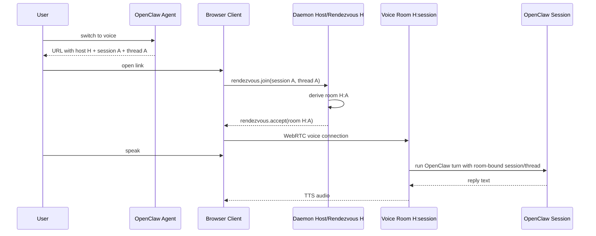

# Rendezvous Voice Handoff Implementation Plan

> **For Claude:** REQUIRED SUB-SKILL: Use superpowers:executing-plans to implement this plan task-by-task.

**Goal:** Make Clawkie-Talkie support Discord-like multiple simultaneous voice handoffs by turning the existing daemon host into a rendezvous/control room and deriving one deterministic voice room per OpenClaw conversation.

**Architecture:** Keep one long-running local Clawkie daemon on the OpenClaw machine. The browser first connects to `host=H` only for coordination, sends the target `sessionId`/`threadId`, and the daemon derives a voice room such as `H:<sessionKey>` for that conversation. Actual voice/STT/TTS/OpenClaw turns happen on the per-session room, not on the shared host room. There is no extra pre-created link state, no random join identifier, no separate mapping table, and no per-handoff daemon startup.

**Tech Stack:** TypeScript, React/Vite client, Node/tsx daemon, simple-peer + `@roamhq/wrtc`, rambly-style signaling, Vitest, OpenClaw CLI integration.

---

## Critical Correction From the Thread

This plan intentionally avoids the stateful design that was rejected.

Do **not** implement:

- random join identifiers
- a pre-created link-state table
- a separate mapping table from link ID to session/thread/room
- local daemon API calls that mutate daemon state just to create a link
- TTL/revocation/claim state for link records
- a “central gateway” style session store

The agreed shape is simpler:

1. The daemon has stable host/rendezvous ID `H`.
2. The agent creates a link for the current conversation:
   - `...?screen=handoff&host=H&session=<sessionId>&threadId=<threadId>`
3. Browser connects to rendezvous room `H`.
4. Browser asks for the session room for `sessionId` / `threadId`.
5. Daemon derives the room deterministically, e.g. `H:<sessionKey>`.
6. Browser connects to that room.
7. Voice turns for A and B are isolated because they use different derived rooms.

The only daemon state should be runtime connection state for active voice rooms, e.g. `roomId -> VoiceSession`, because active WebRTC/STT/TTS sessions necessarily need live objects. That is different from pre-created link state.

---

## Context From Thread

The intended user flow:

1. User is in an OpenClaw/Discord session/thread.
2. User says “switch to voice.”
3. Agent posts a Clawkie-Talkie link.
4. User opens the link.
5. User speaks on the Clawkie page.
6. Clawkie transcribes speech, runs the OpenClaw session, mirrors the transcript/reply back into the originating Discord/OpenClaw thread, and speaks the reply back on the page.

The key repo-backed blocker:

- Current daemon is single-session / one phone at a time.
  - `daemon/README.md` says “Single-session daemon” and “accepts one phone WebRTC DataChannel at a time.”
  - `daemon/src/peer.ts` stores singleton `peer`, `remoteId`, `activeSessionId`, `activeThreadId`, `stt`, `tts`, `chatAbort`, and `turnInFlight` fields.
  - `daemon/src/peer.ts` rejects a second connected phone with `rejecting second phone ... one at a time`.
- Current `host` is the actual signaling room.
  - `client/src/rtc/client.ts` creates `SignalClient({ roomName: opts.hostPeerId })`.
  - `daemon/src/peer.ts` creates `SignalClient({ roomName: opts.peerId })`.
- Current browser sends routing fields at turn start.
  - `client/src/voice/sttDaemon.ts` sends `stt.start(sessionId, threadId)`.
  - `daemon/src/peer.ts` accepts those values and assigns singleton `activeSessionId` / `activeThreadId`.

User-facing production problem:

- Thread A asks “switch to voice” and gets link A.
- Thread B asks “switch to voice” and gets link B.
- Both links target the same daemon host.
- User expects Discord-like independent voice sessions.
- Today, both are trying to use the same singleton phone/WebRTC lane.

Target shape:

- One durable local Clawkie daemon.
- `host=H` is coordination/rendezvous identity, not the single voice lane.
- `sessionId` determines the conversation the user wants.
- Daemon derives a stable per-session `roomId` from `host` + `sessionId`.
- Multiple voice rooms can coexist: A, B, C.
- `stt.start` no longer carries routing each turn; routing is bound once when the per-session room is created.

## Non-Goals

- Do not implement “one daemon per handoff.”
- Do not build a separate hosted/cloud gateway.
- Do not merge Clawkie into OpenClaw core.
- Do not add a pre-created link-state store or random join-ID lifecycle.
- Do not require agents to start/kill/manage Node daemons per handoff.
- Do not run `npm run dev`, `npm run daemon`, or other long-running Node servers during implementation unless David explicitly asks. Use tests/typecheck/build for verification.

---

## Task 1: Add deterministic voice room derivation

**Files:**
- Create: `daemon/src/voiceRoom.ts`
- Create: `client/src/rtc/voiceRoom.ts`
- Create: `test/voiceRoom.test.ts`

**Step 1: Write failing tests**

Create `test/voiceRoom.test.ts`:

```ts
import { describe, expect, it } from 'vitest';
import { makeVoiceRoomId as daemonMakeVoiceRoomId } from '../daemon/src/voiceRoom';
import { makeVoiceRoomId as clientMakeVoiceRoomId } from '../client/src/rtc/voiceRoom';

describe('voice room derivation', () => {
  it('derives the same room id in daemon and client code', () => {
    const input = {
      hostPeerId: 'host-123',
      sessionId: 'agent:main:discord:channel-1:thread-1',
    };

    expect(daemonMakeVoiceRoomId(input)).toBe('host-123:agent_main_discord_channel_1_thread_1');
    expect(clientMakeVoiceRoomId(input)).toBe(daemonMakeVoiceRoomId(input));
  });

  it('keeps different sessions in different rooms', () => {
    expect(
      daemonMakeVoiceRoomId({ hostPeerId: 'host-123', sessionId: 'session-a' }),
    ).not.toBe(
      daemonMakeVoiceRoomId({ hostPeerId: 'host-123', sessionId: 'session-b' }),
    );
  });
});
```

**Step 2: Run test to verify it fails**

```bash
cd /mnt/data/play/web/clawkie-talkie
npm test -- test/voiceRoom.test.ts
```

Expected: FAIL because the files do not exist.

**Step 3: Implement room derivation**

Create `daemon/src/voiceRoom.ts` and `client/src/rtc/voiceRoom.ts` with matching code:

```ts
export interface VoiceRoomInput {
  hostPeerId: string;
  sessionId: string;
}

export function makeVoiceRoomId(input: VoiceRoomInput): string {
  return `${input.hostPeerId}:${safeRoomSegment(input.sessionId)}`;
}

export function safeRoomSegment(value: string): string {
  return value
    .trim()
    .replace(/[^a-zA-Z0-9_-]+/g, '_')
    .replace(/^_+|_+$/g, '')
    .slice(0, 160);
}
```

Important: keep this deterministic. Do not generate random IDs. Do not store mapping state.

**Step 4: Run test to verify it passes**

```bash
npm test -- test/voiceRoom.test.ts
```

Expected: PASS.

**Step 5: Commit**

```bash
git add daemon/src/voiceRoom.ts client/src/rtc/voiceRoom.ts test/voiceRoom.test.ts
git commit -m "feat: derive deterministic voice rooms"
```

---

## Task 2: Add rendezvous join protocol

**Files:**
- Modify: `daemon/src/protocol.ts`
- Modify: `client/src/voice/protocol.ts`
- Modify: `test/protocol.test.ts`

**Step 1: Write failing protocol tests**

Update `test/protocol.test.ts` to cover rendezvous messages:

```ts
expect(phoneClient.rendezvousJoin('session-1', 'thread-1')).toEqual({
  t: 'rendezvous.join',
  sessionId: 'session-1',
  threadId: 'thread-1',
});
expect(daemonClient.rendezvousAccept('host-1:session-1')).toEqual({
  t: 'rendezvous.accept',
  roomId: 'host-1:session-1',
});
expect(daemonClient.rendezvousError('missing_session')).toEqual({
  t: 'rendezvous.error',
  message: 'missing_session',
});
expect(phoneClient.sttStart()).toEqual({ t: 'stt.start' });
```

Remove expectations that `stt.start` serializes `sessionId` and `threadId`.

**Step 2: Run test to verify it fails**

```bash
npm test -- test/protocol.test.ts
```

Expected: FAIL because protocol factories do not exist and `stt.start` still accepts route IDs.

**Step 3: Update protocol files**

In both `daemon/src/protocol.ts` and `client/src/voice/protocol.ts`:

```ts
export type PhoneToDaemon =
  | { t: 'rendezvous.join'; sessionId: string; threadId?: string }
  | { t: 'stt.start' }
  | { t: 'stt.audio.done' }
  | { t: 'stt.cancel' }
  | { t: 'reply.cancel' };

export type DaemonToPhone =
  | { t: 'rendezvous.accept'; roomId: string }
  | { t: 'rendezvous.error'; message: string }
  | { t: 'stt.ready' }
  | { t: 'stt.partial'; text: string; is_final: boolean }
  | { t: 'stt.done'; text: string }
  | { t: 'stt.error'; message: string }
  | { t: 'stt.closed' }
  | { t: 'reply.start'; text: string }
  | { t: 'reply.done'; text: string }
  | { t: 'reply.error'; message: string }
  | { t: 'tts.start'; sample_rate: number }
  | { t: 'tts.done' }
  | { t: 'tts.error'; message: string };
```

Factories:

```ts
export const phoneToDaemon = {
  rendezvousJoin: (sessionId: string, threadId?: string): PhoneToDaemon => ({
    t: 'rendezvous.join',
    sessionId,
    ...(threadId ? { threadId } : {}),
  }),
  sttStart: (): PhoneToDaemon => ({ t: 'stt.start' }),
  sttAudioDone: (): PhoneToDaemon => ({ t: 'stt.audio.done' }),
  sttCancel: (): PhoneToDaemon => ({ t: 'stt.cancel' }),
  replyCancel: (): PhoneToDaemon => ({ t: 'reply.cancel' }),
};

export const daemonToPhone = {
  rendezvousAccept: (roomId: string): DaemonToPhone => ({ t: 'rendezvous.accept', roomId }),
  rendezvousError: (message: string): DaemonToPhone => ({ t: 'rendezvous.error', message }),
  // keep existing factories...
};
```

**Step 4: Run tests**

```bash
npm test -- test/protocol.test.ts test/voiceRoom.test.ts
```

Expected: PASS.

**Step 5: Commit**

```bash
git add daemon/src/protocol.ts client/src/voice/protocol.ts test/protocol.test.ts
git commit -m "feat: add rendezvous join protocol"
```

---

## Task 3: Refactor daemon runtime into multiple `VoiceSession`s

**Files:**
- Create: `daemon/src/voiceSession.ts`
- Modify: `daemon/src/peer.ts`
- Create: `test/voiceSession.test.ts`

**Step 1: Write pure state tests**

Create `test/voiceSession.test.ts`:

```ts
import { describe, expect, it } from 'vitest';
import { createVoiceSessionState } from '../daemon/src/voiceSession';

describe('voice session state', () => {
  it('binds one room to one session/thread for its lifetime', () => {
    const s = createVoiceSessionState({
      roomId: 'host-1:session-1',
      sessionId: 'session-1',
      threadId: 'thread-1',
    });

    expect(s.chatTarget()).toEqual({ sessionId: 'session-1', threadId: 'thread-1' });
    expect(s.roomId).toBe('host-1:session-1');
  });

  it('does not accept route changes on stt.start', () => {
    const s = createVoiceSessionState({
      roomId: 'host-1:session-1',
      sessionId: 'session-1',
      threadId: 'thread-1',
    });

    s.handleStartTurn();

    expect(s.chatTarget()).toEqual({ sessionId: 'session-1', threadId: 'thread-1' });
  });
});
```

**Step 2: Run test to verify it fails**

```bash
npm test -- test/voiceSession.test.ts
```

Expected: FAIL because `daemon/src/voiceSession.ts` does not exist.

**Step 3: Add state core**

Create `daemon/src/voiceSession.ts`:

```ts
export interface VoiceSessionConfig {
  roomId: string;
  sessionId: string;
  threadId?: string;
}

export function createVoiceSessionState(config: VoiceSessionConfig) {
  let turnInFlight = false;

  return {
    roomId: config.roomId,
    handleStartTurn() {
      turnInFlight = true;
    },
    resetTurn() {
      turnInFlight = false;
    },
    get turnInFlight() {
      return turnInFlight;
    },
    chatTarget() {
      return { sessionId: config.sessionId, threadId: config.threadId };
    },
  };
}
```

**Step 4: Move runtime peer/STT/TTS/chat state out of singleton `DaemonPeer`**

Refactor `daemon/src/peer.ts` carefully:

- Keep one host/rendezvous `SignalClient` subscribed to `opts.peerId` / room `opts.peerId`.
- Replace singleton voice fields with active sessions:

```ts
private voiceSessions = new Map<string, VoiceSession>();
```

- `VoiceSession` owns:
  - its own room `SignalClient` with `roomName = roomId`
  - one phone peer for that room
  - `sessionId`
  - `threadId`
  - `stt`
  - `tts`
  - `chatAbort`
  - `turnInFlight`
  - audio source/queue/pump/keepalive for that room

Keep behavior equivalent inside one session. The main change is that state is per room instead of global singleton.

**Step 5: Implement rendezvous handling in `DaemonPeer`**

When a browser connects to host room `H`:

1. Accept only `rendezvous.join` control message.
2. Validate `sessionId` is non-empty.
3. Derive `roomId = makeVoiceRoomId({ hostPeerId: opts.peerId, sessionId })`.
4. Create/start `VoiceSession` for `roomId` if it does not already exist.
5. Send `rendezvous.accept(roomId)` to the browser.
6. Close the host-room peer for that browser.

No pre-created link-state table. No random join-ID validation. No TTL state.

**Step 6: Route turns using room-bound session/thread**

Inside `VoiceSession`, when it receives `stt.start`:

- do **not** read session/thread from the message;
- use the `sessionId`/`threadId` captured at room creation;
- call `runChat({ sessionId, threadId, ... })` exactly as current code does, but from the per-room state.

**Step 7: Run focused checks**

```bash
npm test -- test/voiceSession.test.ts test/protocol.test.ts test/voiceRoom.test.ts
npm run typecheck
```

Expected: PASS.

**Step 8: Commit**

```bash
git add daemon/src/voiceSession.ts daemon/src/peer.ts test/voiceSession.test.ts
git commit -m "feat: split daemon voice state by session room"
```

---

## Task 4: Update browser flow to switch from rendezvous room to voice room

**Files:**
- Modify: `client/src/app.tsx`
- Modify: `client/src/rtc/RtcContext.tsx`
- Modify: `client/src/rtc/client.ts` if needed
- Modify: `client/src/screens/Handoff.tsx`
- Modify: `client/src/screens/Driving.tsx`
- Modify: `client/src/voice/sttDaemon.ts`
- Modify: `test/appRouting.test.ts`

**Step 1: Write URL parsing tests**

Update `test/appRouting.test.ts`:

```ts
it('parses host/session/thread for rendezvous handoff', () => {
  expect(
    parseInitialSearch('?screen=handoff&host=host-1&session=session-1&threadId=thread-1'),
  ).toMatchObject({
    screen: 'handoff',
    hostPeerId: 'host-1',
    sessionId: 'session-1',
    threadId: 'thread-1',
  });
});
```

**Step 2: Run failing test if needed**

```bash
npm test -- test/appRouting.test.ts
```

Expected: PASS if current parser already handles this; otherwise FAIL until updated.

**Step 3: Implement two-phase browser connection**

Current browser connects directly to `hostPeerId` and uses that connection for voice.

Change it to:

1. Handoff screen connects to `hostPeerId` as the rendezvous room.
2. On user enter / start, send:

```ts
phoneToDaemon.rendezvousJoin(sessionId, threadId)
```

3. Wait for `rendezvous.accept` with `roomId`.
4. Close rendezvous `RtcClient`.
5. Create a new `RtcClient` using `hostPeerId = roomId`.
6. Enter `DrivingScreen` using the voice-room connection.

Expose UI states clearly:

- `CONNECTING TO CLAWKIE`
- `JOINING SESSION ROOM`
- `READY`
- `SESSION JOIN FAILED`

**Step 4: Remove route IDs from `stt.start`**

In `client/src/voice/sttDaemon.ts`:

```ts
opts.sendControl(phoneToDaemon.sttStart());
```

Remove `sessionId` / `threadId` from `STTStartOptions` unless tests require temporary compatibility. If compatibility remains, do not use it in the normal rendezvous path.

**Step 5: Run focused checks**

```bash
npm test -- test/appRouting.test.ts test/protocol.test.ts test/drivingReducer.test.ts
npm run typecheck
```

Expected: PASS.

**Step 6: Commit**

```bash
git add client/src/app.tsx client/src/rtc/RtcContext.tsx client/src/rtc/client.ts client/src/screens/Handoff.tsx client/src/screens/Driving.tsx client/src/voice/sttDaemon.ts test/appRouting.test.ts
git commit -m "feat: connect browser through rendezvous room"
```

---

## Task 5: Add active session cleanup and limits only for live voice sessions

**Files:**
- Modify: `daemon/src/voiceSession.ts`
- Modify: `daemon/src/peer.ts`
- Modify: `test/voiceSession.test.ts`

**Step 1: Write cleanup tests**

Add tests for pure cleanup behavior:

```ts
it('marks a voice session closed after cleanup', () => {
  const s = createVoiceSessionState({ roomId: 'host:s1', sessionId: 's1' });
  expect(s.closed).toBe(false);
  s.close();
  expect(s.closed).toBe(true);
});
```

**Step 2: Implement runtime cleanup**

In runtime `VoiceSession`:

- destroy peer on close;
- close room `SignalClient`;
- cancel STT/TTS/chat abort;
- stop keepalive/audio pump;
- notify manager when session closes;
- manager removes `voiceSessions.delete(roomId)`.

Add max active sessions only to prevent resource runaway:

```ts
private readonly maxVoiceSessions = opts.maxVoiceSessions ?? 8;
```

If exceeded, rendezvous returns `rendezvous.error('too_many_voice_sessions')`.

Important: this is active runtime session state only. It is not pre-created link state.

**Step 3: Run focused checks**

```bash
npm test -- test/voiceSession.test.ts test/protocol.test.ts
npm run typecheck
```

Expected: PASS.

**Step 4: Commit**

```bash
git add daemon/src/voiceSession.ts daemon/src/peer.ts test/voiceSession.test.ts
git commit -m "feat: clean up active voice sessions"
```

---

## Task 6: Add a pure URL helper, not a stateful daemon API

**Files:**
- Create: `scripts/create-handoff-link.mjs`
- Modify: `package.json`

**Step 1: Add helper script**

The helper must not call the daemon and must not create daemon state. It only formats the agreed URL.

Command:

```bash
npm run create-handoff-link -- \
  --host host-1 \
  --session-id agent:main:discord:channel-1:thread-1 \
  --thread-id thread-1 \
  --client-origin https://clawkie-talkie.davidguttman.jump.sh
```

Output:

```text
https://clawkie-talkie.davidguttman.jump.sh/?screen=handoff&host=host-1&session=agent%3Amain%3Adiscord%3Achannel-1%3Athread-1&threadId=thread-1
```

**Step 2: Implement script**

Create `scripts/create-handoff-link.mjs`:

```js
const args = parseArgs(process.argv.slice(2));
const host = args.host;
const sessionId = args['session-id'];
const threadId = args['thread-id'];
const clientOrigin = args['client-origin'] || process.env.CT_CLIENT_ORIGIN;

if (!host) die('--host is required');
if (!sessionId) die('--session-id is required');
if (!clientOrigin) die('--client-origin or CT_CLIENT_ORIGIN is required');

const url = new URL(clientOrigin.replace(/\/$/, '') + '/');
url.searchParams.set('screen', 'handoff');
url.searchParams.set('host', host);
url.searchParams.set('session', sessionId);
if (threadId) url.searchParams.set('threadId', threadId);
console.log(url.toString());

function parseArgs(argv) {
  const out = {};
  for (let i = 0; i < argv.length; i++) {
    const arg = argv[i];
    if (!arg.startsWith('--')) continue;
    out[arg.slice(2)] = argv[++i];
  }
  return out;
}

function die(msg) {
  console.error(msg);
  process.exit(1);
}
```

**Step 3: Add package script**

Modify `package.json`:

```json
{
  "scripts": {
    "create-handoff-link": "node scripts/create-handoff-link.mjs"
  }
}
```

**Step 4: Verify script without starting servers**

```bash
node scripts/create-handoff-link.mjs \
  --host host-1 \
  --session-id session-1 \
  --thread-id thread-1 \
  --client-origin https://clawkie-talkie.davidguttman.jump.sh
```

Expected output:

```text
https://clawkie-talkie.davidguttman.jump.sh/?screen=handoff&host=host-1&session=session-1&threadId=thread-1
```

**Step 5: Commit**

```bash
git add package.json scripts/create-handoff-link.mjs
git commit -m "feat: add deterministic handoff link helper"
```

---

## Task 7: Update docs for deterministic rendezvous

**Files:**
- Modify: `daemon/README.md`
- Create: `docs/voice-handoff.md`

**Step 1: Update daemon README**

Replace “Single-session daemon” framing with:

- daemon is a local rendezvous daemon;
- `host` is a control/rendezvous room;
- voice happens on deterministic per-session rooms;
- browser links contain `host`, `session`, and optional `threadId`;
- no pre-created link-state lifecycle exists.

Document:

```bash
npm run daemon -- \
  --client-origin https://clawkie-talkie.davidguttman.jump.sh
```

And:

```bash
npm run create-handoff-link -- \
  --host <daemon-peer-id> \
  --session-id <openclaw-session-id> \
  --thread-id <discord-thread-id> \
  --client-origin https://clawkie-talkie.davidguttman.jump.sh
```

**Step 2: Create design doc**

Create `docs/voice-handoff.md` with:

- user story;
- old singleton architecture;
- new deterministic rendezvous architecture;
- sequence diagram;
- failure states;
- testing checklist.

Suggested Mermaid:



**Step 3: Run docs-adjacent checks**

```bash
npm run typecheck
npm test
```

Expected: PASS.

**Step 4: Commit**

```bash
git add daemon/README.md docs/voice-handoff.md
git commit -m "docs: describe deterministic rendezvous voice handoff"
```

---

## Task 8: Add integration-style test for two simultaneous sessions

**Files:**
- Create: `test/multiSessionRendezvous.test.ts`
- Modify test helpers as needed.

**Step 1: Write state/protocol-level test**

Do not require real WebRTC in CI. Test the manager behavior with fake voice sessions.

Desired behavior:

```ts
describe('multi-session rendezvous', () => {
  it('derives separate rooms for separate sessions on the same host', () => {
    const host = 'host-1';
    const roomA = makeVoiceRoomId({ hostPeerId: host, sessionId: 'session-a' });
    const roomB = makeVoiceRoomId({ hostPeerId: host, sessionId: 'session-b' });

    expect(roomA).toBe('host-1:session-a');
    expect(roomB).toBe('host-1:session-b');
    expect(roomA).not.toBe(roomB);
  });

  it('keeps chat targets isolated by room', () => {
    const a = createVoiceSessionState({
      roomId: 'host-1:session-a',
      sessionId: 'session-a',
      threadId: 'thread-a',
    });
    const b = createVoiceSessionState({
      roomId: 'host-1:session-b',
      sessionId: 'session-b',
      threadId: 'thread-b',
    });

    expect(a.chatTarget()).toEqual({ sessionId: 'session-a', threadId: 'thread-a' });
    expect(b.chatTarget()).toEqual({ sessionId: 'session-b', threadId: 'thread-b' });
  });
});
```

If `DaemonPeer` is too coupled to WebRTC to test directly, extract a pure `VoiceSessionManager`:

- Create: `daemon/src/voiceSessionManager.ts`
- Test: `test/voiceSessionManager.test.ts`

Manager responsibilities:

- derive room from host/session;
- create/get active `VoiceSession` by room;
- enforce max active sessions;
- remove sessions on cleanup.

**Step 2: Run focused tests**

```bash
npm test -- test/multiSessionRendezvous.test.ts test/voiceSession.test.ts test/voiceRoom.test.ts
npm run typecheck
```

Expected: PASS.

**Step 3: Commit**

```bash
git add daemon/src/voiceSessionManager.ts test/multiSessionRendezvous.test.ts test/voiceSessionManager.test.ts
git commit -m "test: cover multi-session rendezvous"
```

---

## Task 9: Final verification gate

**Files:**
- No new files unless fixing failures.

**Step 1: Run full automated checks**

```bash
cd /mnt/data/play/web/clawkie-talkie
npm test
npm run typecheck
npm run build
```

Expected:

- Vitest passes.
- TypeScript passes for client and daemon.
- Vite build succeeds.

**Step 2: Inspect git diff**

```bash
git status --short
git diff --stat
```

Expected:

- Only intended files changed.
- No `.env`, `node_modules`, build artifacts, or credentials committed.

**Step 3: Optional live verification only if David explicitly asks**

Because this requires running Node server/daemon processes, do not do it silently.

If authorized, verify:

1. Start existing project dev flow in the approved way.
2. Create link A for thread/session A.
3. Create link B for thread/session B.
4. Open both links in separate browser tabs/devices.
5. Confirm both reach READY independently.
6. Speak one deterministic fixture or mic turn in A.
7. Confirm transcript/reply mirrors to A only.
8. Speak one turn in B.
9. Confirm transcript/reply mirrors to B only.
10. Confirm closing A does not close B.

---

## Completion Criteria

The feature is complete when:

- `npm test` passes.
- `npm run typecheck` passes.
- `npm run build` passes.
- `host=H` is rendezvous/control only.
- The actual voice WebRTC session uses a derived per-session room.
- Daemon can hold at least two simultaneous independent voice sessions.
- Each voice session has its own room-bound `sessionId/threadId` for chat routing.
- `stt.start` no longer accepts or sets routing fields per turn.
- There is no pre-created link-state table / random join-ID store / TTL lifecycle for link creation.
- Docs describe deterministic rendezvous accurately.

## Recommended Commit Sequence

1. `feat: derive deterministic voice rooms`
2. `feat: add rendezvous join protocol`
3. `feat: split daemon voice state by session room`
4. `feat: connect browser through rendezvous room`
5. `feat: clean up active voice sessions`
6. `feat: add deterministic handoff link helper`
7. `docs: describe deterministic rendezvous voice handoff`
8. `test: cover multi-session rendezvous`

## Execution Notes

- Work in `/mnt/data/play/web/clawkie-talkie` on the current branch unless David explicitly asks for a worktree.
- This is a local-only/pre-release project; do not create a worktree by default.
- Do not push unless David explicitly asks.
- Do not commit credentials.
- Do not start or kill Node servers during automated implementation unless David explicitly authorizes live verification.
- Prefer small commits after each task.
- If implementation reveals that deterministic rooms cannot work with the current signaling server semantics, stop and report that exact blocker before adding stateful handoff machinery.
