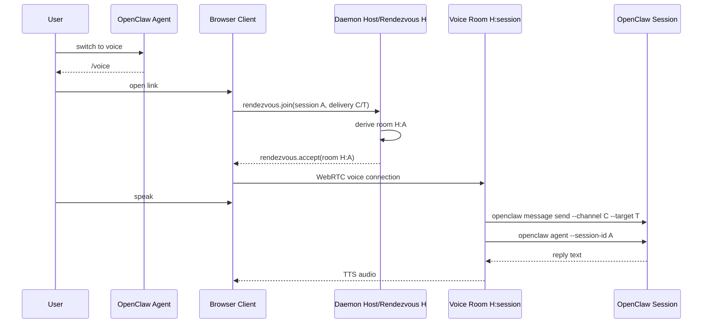

# Voice Handoff (Deterministic Rendezvous)

## User story

1. User is in an OpenClaw session on any channel/surface.
2. User says "switch to voice".
3. The agent posts a Clawkie-Talkie `/voice#…` link built directly from the
   current OpenClaw turn — no helper script, no daemon API call, no
   pre-created link record.
4. User opens the link.
5. User speaks. Clawkie transcribes, mirrors the transcript into the
   originating OpenClaw conversation, runs the OpenClaw session, and speaks
   the reply back.

## Old singleton architecture

Before this design the daemon was single-session: one phone at a time, one
shared `activeSessionId` / `activeThreadId`, one set of WebRTC/STT/TTS
singletons. Two threads asking the user to "switch to voice" produced two
links to the same lane and stomped on each other.

## Deterministic rendezvous

There is now exactly one durable local daemon. `host=H` is a stable
rendezvous/control identity, not the voice lane.

For each handoff the agent fills the URL with values already present in the
turn:

```
https://clawkietalkie.app/voice#host=H&session=<sessionId>&channel=<channel>&target=<target>
```

The browser:

1. Joins the rendezvous room `H`.
2. Sends `rendezvous.join { sessionId, delivery: { channel, target } }` once.
3. Receives `rendezvous.accept { roomId }`, where
   `roomId = makeVoiceRoomId({ hostPeerId: H, sessionId })`.
4. Reconnects to `roomId` and runs the voice turn there.

The daemon derives the same `roomId` deterministically. There is no
pre-created link record, random join id, TTL, claim, revocation, or central
session store.

The only daemon state that survives between turns is `roomId -> VoiceSession`
for actively connected voice rooms — necessary because WebRTC/STT/TTS need
live objects.

## URL contract

- `/` — marketing landing page placeholder.
- `/voice` — public user-facing voice handoff path. Forwards to `/voice.html`
  while preserving both `?…` and `#…`.
- `/voice.html` — voice app HTML.

Required handoff args (accepted from hash fragment, then query string):

- `host` — daemon rendezvous/control room id
- `session` — OpenClaw session key/id, passed later to
  `openclaw agent --session-id`
- `channel` — OpenClaw delivery channel, passed later to
  `openclaw message send --channel`
- `target` — OpenClaw delivery target, passed later to
  `openclaw message send --target`

Hash wins over query when both are present. All values must be URL-encoded.

### Why hash-first?

Hash fragments are not transmitted on HTTP requests, so `host`, `session`,
`channel`, and `target` never reach a web server. The browser parses them
locally and sends them only over the encrypted WebRTC DataChannel to the
local daemon.

## Sequence



## Failure states

- `rendezvous.error("missing_session_or_delivery")` — required fields missing.
- `rendezvous.error("too_many_voice_sessions")` — daemon at active-room cap
  and the requested session is not already active.
- `rendezvous.error("unexpected_message")` — first message on the rendezvous
  lane was not `rendezvous.join`.

## Testing checklist

- `npm test` — unit/contract tests including `voiceRoom`, `voiceSession`,
  `protocol`, `chatSession`, `appRouting`, `appEntry`,
  `multiSessionRendezvous`.
- `npm run typecheck` — client and daemon TypeScript.
- `npm run build` — Vite multi-page build emits `/`, `/voice.html`, and
  `/voice/index.html`.
- Live verification (only with explicit authorization): two simultaneous
  `/voice#…` links pointing at the same `host=H` but different `session`
  values must reach READY independently and not cross-talk.
