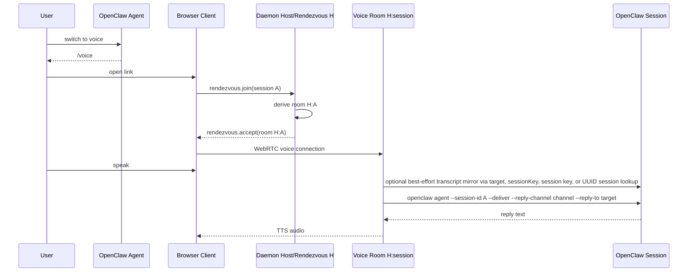

# Voice Handoff (Deterministic Rendezvous)

## User story

1. User is in an OpenClaw session on any channel/surface.
2. User says "switch to voice".
3. The agent posts a Clawkie-Talkie `/voice#…` link built directly from the
   current OpenClaw turn — no helper script, no daemon API call, no
   pre-created link record.
4. User opens the link.
5. User speaks. Clawkie transcribes, best-effort mirrors the transcript when
   it can resolve a Discord target, runs the OpenClaw session, and speaks the
   reply back. Transcript mirroring is not part of the critical reply path.

## Old singleton architecture

Before this design the daemon was single-session: one phone at a time, one
shared `activeSessionId` / `activeThreadId`, one set of WebRTC/STT/TTS
singletons. Two threads asking the user to "switch to voice" produced two
links to the same lane and stomped on each other.

## Deterministic rendezvous

There is now exactly one durable local daemon. `host=H` is a stable
rendezvous/control identity, not the voice lane.

For each handoff the agent fills the URL with values already present in the
turn:

```
https://clawkietalkie.app/voice#host=H&session=<sessionId>&sessionKey=<sessionKey>&channel=<channel>&target=<target>&accountId=<accountId>
```

Prefer the actual OpenClaw `sessionId` UUID for `session` when it is visible.
When both the actual sessionId and exact current OpenClaw session key are
visible, include the key as optional `sessionKey` routing metadata. If an
explicit current delivery channel/target is visible, include `channel` and
`target` so the daemon can mirror the transcript with `openclaw message send`.
If the actual sessionId is unavailable, fall back to the exact current OpenClaw
session key in `session` and omit `sessionKey`. For webchat/internal handoffs,
`session=agent:main:main` is valid only as that fallback. `accountId` is optional
and should be included only when the current runtime exposes it.

The browser:

1. Joins the rendezvous room `H`.
2. Sends `rendezvous.join { sessionId, sessionKey?, delivery? }` once.
3. Receives `rendezvous.accept { roomId }`, where
   `roomId = makeVoiceRoomId({ hostPeerId: H, sessionId })`.
4. Reconnects to `roomId` and runs the voice turn there.

The daemon derives the same `roomId` deterministically. There is no
pre-created link record, random join id, TTL, claim, revocation, or central
session store.

The only daemon state that survives between turns is `roomId -> VoiceSession`
for actively connected voice rooms — necessary because WebRTC/STT/TTS need
live objects.

## Protocol and capability negotiation

The browser client is current by definition because users load the hosted
Clawkie Talkie UI at handoff time. Only the installed daemon can lag behind the
public browser build. When the browser and daemon cannot agree on the WebRTC
DataChannel protocol or required capabilities, surface it as a daemon
protocol/capability mismatch and tell the installer to update the installed
daemon while preserving `DAEMON_PEER_ID`.

## TTS and STT catalogs and settings

The daemon is the source of truth for both TTS (speech output) and STT
(transcription input) provider metadata. After the browser opens the
per-session voice room, it requests both catalogs once:

- `tts.catalog.request` → daemon loads `openclaw infer tts providers --json` and
  replies with `tts.catalog`.
- `stt.catalog.request` → daemon loads `openclaw infer audio providers --json`
  and replies with `stt.catalog`.

Both catalogs are normalized and sent over the WebRTC DataChannel.

Phone settings store only ids — `tts: { providerId, model, voice }` and
`stt: { providerId, model }`. They do not store provider credentials or
provider-specific auth material. The phone selects TTS and STT independently:
choosing OpenAI for TTS does not pin transcription to OpenAI, and vice versa.

The phone communicates selections to the daemon over the same voice room:

- An initial selection is included in `rendezvous.join { settings: {…} }`.
- Subsequent changes flow as `settings.update { settings: { tts?, stt?, voice? } }`.

The daemon applies selections per request:

- TTS: `openclaw infer tts convert --model <provider>/<model> --voice <voice>`
  (model and voice are passed only when both fields are non-empty).
- STT: `openclaw infer audio transcribe --file <wav> --json --model
  <provider>/<model>` (model is passed only when both provider and model are
  non-empty; the optional `--language` hint is preserved).

Clawkie Talkie must not call `openclaw infer tts set-provider`, an equivalent
global audio set-provider, or any other command that mutates OpenClaw's global
provider preferences. If OpenClaw reports a provider but does not expose a
model id that can be passed to `--model`, the settings UI should hide or
disable that provider instead of falling back to global provider mutation.

## URL contract

- `/` — marketing landing page placeholder.
- `/voice/` — canonical public user-facing voice handoff path. Static hosts
  serve this from `/voice/index.html`.
- `/voice` — clean public handoff URL used in generated links; static hosts
  resolve it to `/voice/`.
- `/dashboard#host=H` — canonical host-scoped dashboard URL for daemon output
  and home-screen install. Users should add this page to the home screen; the
  manifest intentionally omits a static `start_url` so installed launches
  preserve the chosen dashboard URL/hash. It connects to the daemon rendezvous
  room, requests recent OpenClaw sessions, and sends `rendezvous.join` only
  after the user selects a session.
- `/dashboard/` with no `host` can recover the last dashboard host remembered
  by the browser. Without a saved host, it shows the missing/bad-session state.
- `/voice#host=H` host-only entries are accepted as dashboard-compatible links
  for startup/connectivity flows. Root `/?host=H` is not a supported app
  entrypoint because `/` is marketing-only.

Required voice handoff args (accepted from hash fragment, then query string):

- `host` — daemon rendezvous/control room id.
- `session` — OpenClaw session id/key, passed later to
  `openclaw agent --session-id`. Prefer the actual OpenClaw sessionId UUID
  when available; use a session key only when the actual sessionId is not
  visible. For webchat-only fallback handoffs, use `agent:main:main` only for
  non-delivered internal/webchat smoke paths. Older `agent:main:webchat` links
  are normalized to this webchat form.
- `sessionKey` — optional exact OpenClaw session key. Use it when `session`
  is the actual sessionId UUID and the current session key is also visible in
  trusted runtime context. The daemon uses it to select the OpenClaw agent and
  derive Discord reply/transcript routing when possible.
- `channel` + `target` — explicit current message delivery route, such
  as `channel=discord` and `target=channel:1498020851298209852`. Include both
  when visible. The daemon passes them to `openclaw agent --deliver` as
  `--reply-channel` and `--reply-to` for assistant text delivery; transcript
  mirroring also uses them best-effort via `openclaw message send`.
- `accountId` — optional channel account id, forwarded to reply delivery and
  transcript mirroring when explicit `channel` + `target` routing is used.

Assistant reply delivery is mandatory for delivered voice turns: the daemon
uses explicit `channel` + `target`, a Discord `sessionKey`/colon-style
Discord `session`, or a UUID reverse-resolved through `openclaw sessions
--json --all-agents --active 10080` to pass `--deliver --reply-channel
<channel> --reply-to <target>` to `openclaw agent`. If no reply target can be
derived, the voice turn fails before running the agent. Transcript mirroring is
best-effort and may be skipped without failing the voice turn.

Hash wins over query when both are present. All values must be URL-encoded.

Examples:

```
https://clawkietalkie.app/voice#host=H&session=c44d9502-ce71-46b1-9b15-5d548004544a&sessionKey=agent%3Amain%3Adiscord%3Achannel%3A1498020851298209852&channel=discord&target=channel%3A1498020851298209852
https://clawkietalkie.app/voice#host=H&session=agent%3Amain%3Amain
```

### Why hash-first?

Hash fragments are not transmitted on HTTP requests, so `host`, `session`,
`sessionKey`, `channel`, `target`, and `accountId` never reach a web server. The browser parses them
locally and sends them only over the encrypted WebRTC DataChannel to the
local daemon.

## Sequence



## Failure states

- `rendezvous.error("missing_session")` — required session field missing.
- `rendezvous.error("too_many_voice_sessions")` — daemon at active-room cap
  and the requested session is not already active.
- `rendezvous.error("unexpected_message")` — first message on the rendezvous
  lane was not `rendezvous.join`.

## Testing checklist

- `npm test` — unit/contract tests including `voiceRoom`, `voiceSession`,
  `protocol`, `chatSession`, `appRouting`, `appEntry`,
  `multiSessionRendezvous`.
- `npm run typecheck` — client and daemon TypeScript.
- `npm run build` — Vite multi-page build emits `/` and canonical
  `/voice/index.html`.
- `openclaw infer tts providers --json` — catalog includes at least one
  configured provider.
- `openclaw infer audio providers --json` — bare-array audio provider catalog
  includes at least one configured provider with a `defaultModels.audio` value.
- `openclaw infer tts convert --text "catalog smoke" --output
  /tmp/clawkie-tts-smoke.mp3 --json --model openai/gpt-4o-mini-tts
  --voice nova` — explicit per-request TTS smoke returns JSON with an output
  path and does not require `openclaw infer tts set-provider`.
- `openclaw infer audio transcribe --file <fixture.wav> --json --model
  <configured-provider>/<model>` — explicit per-request STT smoke returns JSON
  with a transcript text and does not mutate OpenClaw's global audio provider.
- Live verification (only with explicit authorization): two simultaneous
  `/voice#…` links pointing at the same `host=H` but different `session`
  values must reach READY independently and not cross-talk.
